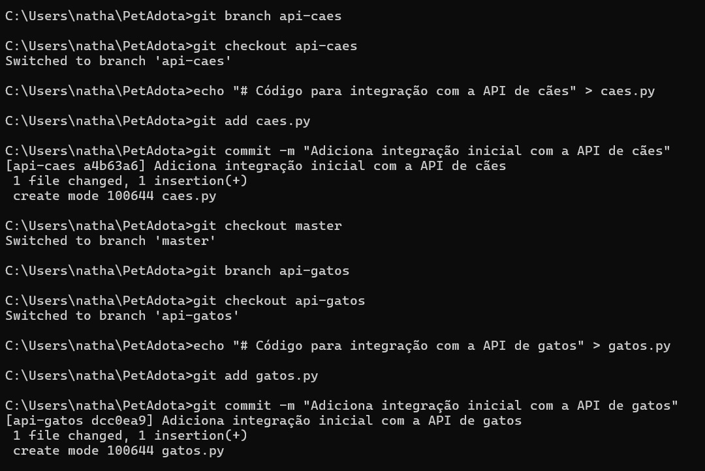
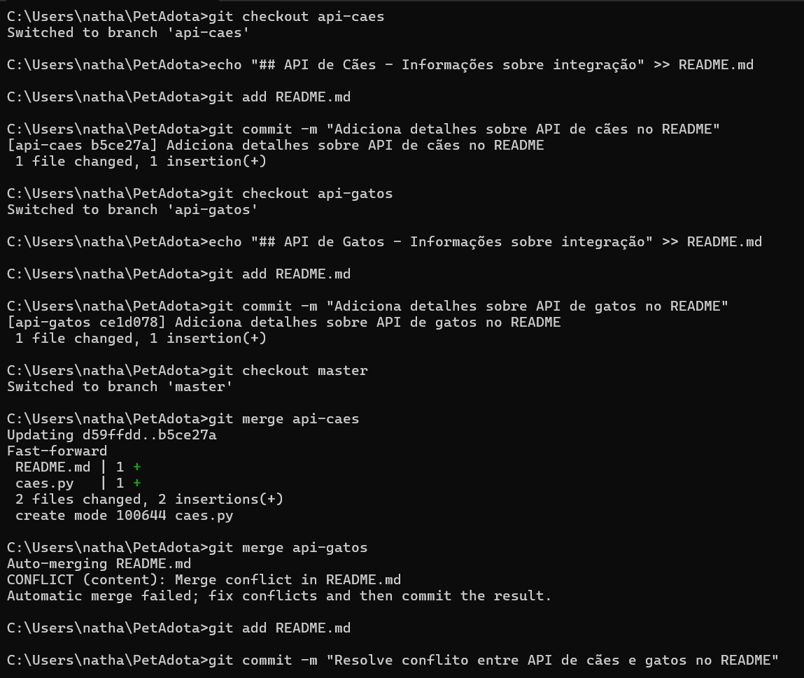
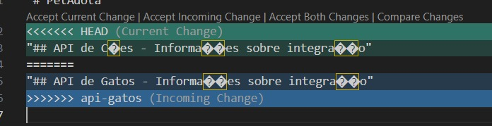
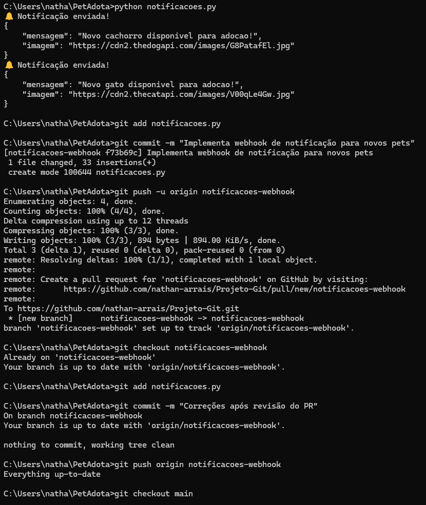
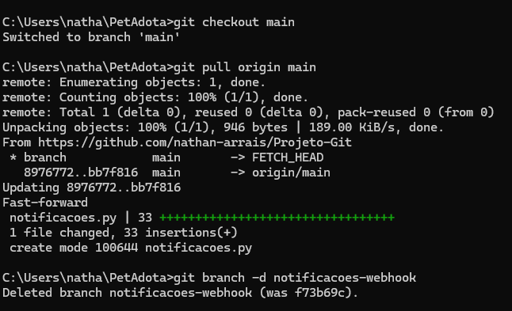

# Projeto SQL

## Descrição:

A PetAdota é uma startup que facilita a adoção de cães e gatos, colaborando com bancos de dados de prefeituras e ONGs locais.
Para o desenvolvimento do projeto, utilizaremos Git e GitHub para gerenciar o código e as integrações com APIs públicas.

- 🐶 Dog API: https://dog.ceo
- 🐱 Cat API: https://api.thecatapi.com

### Objetivos do Projeto:
- Utilizar o Git para controle de versão do código, permitindo rastreabilidade e colaboração eficiente. 
- Integrar repositórios locais ao GitHub para facilitar o trabalho em equipe.
- Criar fluxos de trabalho colaborativos para desenvolver soluções automatizadas.

### Ferramentas para utilizar e entregar meus exercícios:
- GitHub: Repositórios remotos para armazenar e compartilhar o código do projeto.

## Atividade Prática (1)

Criar um repositório local para o projeto PetAdota e versionar os primeiros arquivos.

- Iniciar o repositório (PetAdota) ✔️
- Adicionar arquivos iniciais (readme.md) ✔️
- Adicionar e commitar os arquivos ✔️
- Verificar o histórico ✔️

## Atividade Prática (2)

Criar branches separadas para desenvolver funcionalidades diferentes do projeto.

- Criar uma branch para a integração com a API de cães: ✔️
- Alternar para a nova Branch ✔️
- Adicionar um arquivo para a funcionalidade ✔️
- Criar uma branch para a integração com a API de gatos ✔️

## Atividade Prática (3)

Simular um conflito ao combinar duas branches no repositório principal.

- Alterar o arquivo README.md na branch api-dogs ✔️
- Alterar o mesmo arquivo na branch api-cats ✔️
- Fazer o merge das branches na main ✔️
- Resolver o conflito ✔️

## Atividade Prática (4)

Conectar o repositório local ao GitHub e publicar o código do projeto.

- Criar um repositório no GitHub ✔️
- Adicionar o repositório remoto ao projeto local ✔️
- Enviar as mudanças para o GitHub ✔️
- Publicar outras branches ✔️

## Atividade Prática (5)

Neste exercício, você simulará um fluxo completo de desenvolvimento colaborativo para o projeto PetAdota,
passando por todas as etapas de criação, revisão e integração de uma funcionalidade.

- Criar uma branch chamada notificacoes-webhook para implementar notificações automáticas de novos pets disponíveis para adoção. ✔️
- Escrever uma função que envia notificações (simulada no terminal) e fazer o primeiro commit. Subir a branch para o GitHub e fazer o primeiro commit. ✔️
- Subir a branch para o GitHub e criar um Pull Request para a branch principal. ✔️
- Revisar o código no Pull Request e sugerir melhorias. ✔️
- Implementar as correções sugeridas na revisão e atualizar o Pull Request. ✔️
- Finalizar o merge da branch notificacoes-webhook na branch main. ✔️
- Sincronizar o repositório local com as mudanças integradas. ✔️

## Tecnologias utilizadas:

- Python
- Git